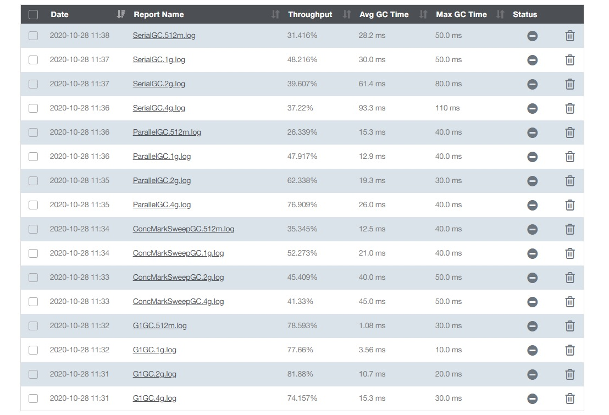

 ####1. GC 总结




+ 串行gc在这次统计明显效果不佳，难道应该废弃？答案是否定的，如在单核环境下，或当cpu资源被应用线程压榨的很厉害，那就应该选择串行gc，或降级为串行gc，少量的内存资源也可以选择串行gc

+ 并行gc是jdk8 默认的垃圾收集器，无论从吞吐延迟，都相比串行gc有较大的提升，尤其在吞吐，有较大的提升 

+ cms收集，在吞吐，延迟等方面做了很好的平衡，但是个人认为用起来过于复杂，据统计有100多个相关设置参数，jdk9 废弃？

+ g1gc，弱化分代概念，性能有很大提升和突破，服务器的硬件会越来越便宜，那就会催生很多大内存容器，在大内存时代，g1gc绝对是分代集器望尘莫及，jdk9默认收集器，但同时对cpu 内存要求较高，小于4g慎用

+ 这四种收集器是jdk8常用的，但是并不是单兵作战，有各种组合环境，如果生产环境需要更换gc，建议多多测试，因为gc的相关参数实在太多，oracle官方同样建议，不要设置gc相关，而是改变堆内存分配

+ 如果之后有对gc相关理解，我会继续补充


 ####2. httpclient

 ```java
//代码块:
public class HttpclienttestApplication {
	//HttpClient客户端
	private static CloseableHttpClient httpClient ;
	//响应
	private static CloseableHttpResponse httpResponse;

	public static void main(String[] args) {
		try {
			//创建一个httpClient对象，相当于创建了一个浏览器，用来访问URL链接
			httpClient = HttpClients.createDefault();
			//创建Get请求
			HttpGet httpGet = new HttpGet("http://localhost:8088/api/hello");
			//访问这个Get链接
			httpResponse = httpClient.execute(httpGet);
			String s = EntityUtils.toString(httpResponse.getEntity(), "utf-8");
			System.out.println(s);
		} catch (IOException e) {
			e.printStackTrace();
		}
	}
}
```

